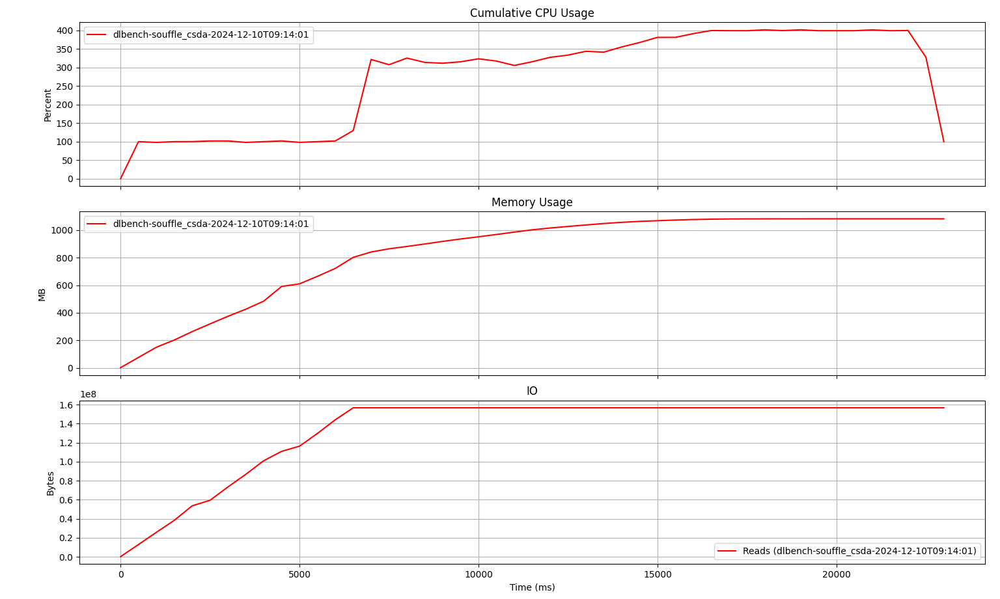

# DLBench

## Install

```sh
git clone https://github.com/srinskit/dlbench

pip install --user dlbench/
```

## Uninstall

```sh
pip uninstall dlbench
```

## Usage

### Benchmark a run

`dlbench run` takes as input a shell command that would execute the benchmark target. It starts the benchmark target as a subprocess and monitors it's resource utilization. The resource utilization metrics are stored into a `.log` file, which can be plotted on a graph using `dlbench plot`.

#### Examples

##### Souffle
Souffle in interpreter mode
``` sh
dlbench run "souffle -j 4 -F test -D test test/reachable.dl"
```

Souffle in compiled mode
``` sh
dlbench run "test/sou-reachable -F test"
```
##### DDlog

``` sh
dlbench run "./ddlog-test/reachable_ddlog/target/release/reachable_cli -w 4 < ddlog-test/edge.facts"
```
##### RecStep


### Plot runs

#### Plot a run

Plot a run using it's `.log` file.

``` sh
dlbench plot --logs "dlbench-sou-reachable.log"
```

#### Plot and compare multiple runs

Plot and compare multiple runs using their `.log` files.

``` sh
dlbench plot --logs "dlbench-sou-reachable.log" "dlbench-ddlog-reachable.log" 
```
#### Plot and compare last n runs

Plot recent runs. For instance, `dlbench plot --last 2` picks up the two most recent `.log` files in the current working directory and plots them for comparison.

``` sh
dlbench plot --last <n>
```
``` sh
dlbench plot --last 1
```
``` sh
dlbench plot --last 3
```

### Understanding the plot



`dlbench plot` generates a single graph with the following charts:

* Chart 1 plots vs time the cumulative CPU utilization, i.e., sum of the instantaneous CPU utlization (percent) of all worker threads in the target process. Cumulative utilization was chosen to minimize cluter when comparing multiple runs.
* Chart 2 plots vs time the instantaneous memory utilization of the process.
* Chart 3 plots vs time the total disk reads by the process.

Note: the time axis is currently not in milliseconds. It is simply the loop counter in the loop that samples the metrics. Will be fixed soon.