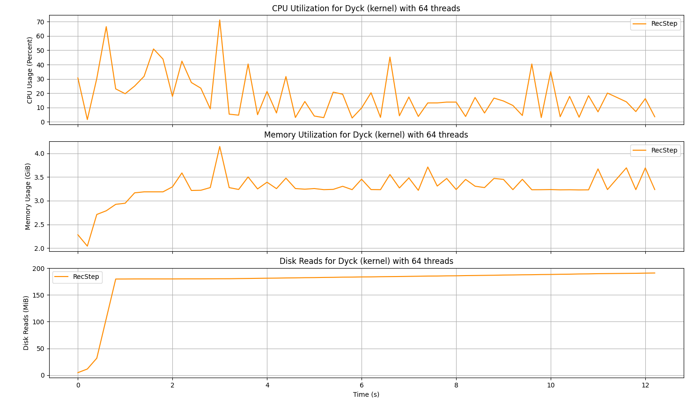

# DLBench

A utility to monitor, plot and compare resource utilization of programs.

## Install

```sh
git clone https://github.com/srinskit/dlbench

pip install --user dlbench/
```

## Uninstall

```sh
pip uninstall dlbench
```

## Usage

### Benchmark a Run

`dlbench run` takes as input a shell command `cmd` that would execute the benchmark target. It starts the benchmark target as a subprocess and monitors it's resource utilization. DLBench monitors the CPU utilization, memory utilization and disk reads of the benchmark target and any subprocess of the target. Additional `systemd` background processes can be monitored by specifiying their names in the `--monitor` argument. The reported utilization for any metric is the sum of utilizations of all the above processes.

`dlbench run` also takes as input a string `tag`, which is used to label the following files created by DLBench:
* The resource utilization metrics are stored into a `<tag>.log` file. 
* The output (`stdout`) of the target is stored into a `<tag>.out` file.

Specifying the option `--suffix-time` will append a timestamp to the tag to make it unique.

```sh
dlbench run --help

usage: dlbench run [-h] [--suffix-time] [--monitor process [process ...]] cmd tag

positional arguments:
  cmd                   Shell command that would execute the benchmark target
  tag                   Name to tag the results with

options:
  -h, --help            show this help message and exit
  --suffix-time         Suffix the tag with a timestamp
  --monitor process [process ...]
                        Names of additional systemd processes to monitor
```

### Benchmark Examples

Benchmark the included sample program with argument `5`:
```sh
dlbench run "./testproc.sh 5" test1
```

```sh
Run name: test1
Started process: testproc.sh
Logging stats to: test1.log
STATS: (37.16, 0.0, 954368, 185811385, 2)
```
```sh
ls test1*

test1.log  test1.out
```

#### Souffle
Souffle in interpreter mode
``` sh
dlbench run "souffle -j 4 -F test -D test reach.dl" "reach_4_souffle-intptr" 
```

Souffle in compiled mode
``` sh
dlbench run "./souffle-reach -F test" "reach_souffle-cmpl"
```

#### RecStep

Monitor the QuickStep database process in-addition to RecStep.

```sh
dlbench run "recstep --program reach.dl --input /data --jobs 64" "reach_64_recstep" -m quickstep_cli_shell
```

#### DDlog

Supply inputs to the benchmark target process using input redirections.

``` sh
dlbench run "./reach_ddlog/target/release/reach_cli -w 4 < ddlog-test/edge.facts" "ddlog"
```

### Plot Runs

`dlbench plot` is used to plot resource utilization data from one or more `<tag>.log` files. If multiple log files are specified, their resource utilization is plotted on the same chart for comparison. 

Log files can be specified with the `--logs` argument. File names and patterns are accepted. Alternatively, `--last <n>` can be used to plot the `n` most recent log files in the current working directory.

The `--metrics` argument can be used to specify what charts are plotted. For example, `--metrics c` plot only the CPU utilization and `--metrics cr` plots the CPU utilization and disk reads. The `--pretty` flag is used to remove outliers and smooth the plot.

```sh
dlbench plot --help

usage: dlbench plot [-h] [--interval INTERVAL] [--memclip Memory Limit (GiB)] [--raw] [--fullscreen] [--skip acronym]
                    [--metrics acronym] (--logs file [file ...] | --last count)

options:
  -h, --help            show this help message and exit
  --interval INTERVAL   The resolution of the time axis in seconds
  --memclip Memory Limit (GiB)
                        The maximum memory utilization to be shown
  --raw                 Do not enhance label and plot order
  --fullscreen          Show plot in fullscreen window
  --skip acronym        Engines to skip (f: Flowlog, s: Souffle (compiled), i: Souffle (interpreted), r: RecStep, d: DDLog)
  --metrics acronym     Metrics to plot (c: CPU, m: memory, r: disk reads)
  --logs file [file ...]
                        Path to log files of runs
  --last count          Plot recent runs
```

### Plot Examples

#### Raw Plots

Plot a log file:

```sh
dlbench plot --logs test1.log --raw
```


Plot results of last two runs `test1` and `test2`:

```sh
dlbench plot --logs test1.log test2.log --raw

# or

dlbench plot --logs test*.log --raw

# or

dlbench plot --last 2 --raw
```


#### Pretty Plot (default)

By not specifying `--raw` in the argument list, the plot will be plotted in pretty mode. Note that pretty mode can be used only when plotting a single experiment, for example plotting logs of all engines but specifically for the CSPA program, linux dataset, and with 64 threads. Here are some suggested enhancements to go along with it:

##### Interval

Sample resource utilizations within the supplied time-window, and plot the medians within the time-window.

```sh
dlbench plot --logs results/Dyck*kernel*_64*.log --interval .2
```

##### Metrics

Plot only specified metrics. The below command plots only CPU utilization.

```sh
dlbench plot --logs results/Dyck*kernel*_64*.log --interval .2 --metrics c
```


##### Skip Engines

Skip plotting certain engines. The below example does not plot DDlog and Souffle Interpreter despite including their log files.

```sh
dlbench plot --logs results/Dyck*kernel*_64*.log --interval .2 --metrics c --skip di
```

#### Limit Memory

Place an upperbound on the memory utilization plotted.

```sh
dlbench plot --logs results/Dyck*kernel*_64*.log --interval .2 --metrics m --memclip 256
```

#### Fullscreen

Show the plot in fullscreen. This is also useful if your plot is running into an exception in the regular-screen mode- fullscreen should be more robust across platforms.

```sh
dlbench plot --logs results/Dyck*kernel*_64*.log --interval .2 --metrics m --fullscreen
```

### Understanding the plot



In the above plot:

* The first chart plots vs time the cumulative CPU utilization, i.e., sum of the instantaneous CPU utlization (percent) of all worker threads in the target process. Cumulative utilization was chosen to minimize cluter when comparing multiple runs.
* The second chart plots vs time the instantaneous memory utilization of the process.
* The final chart plots vs time the total disk reads by the process.
